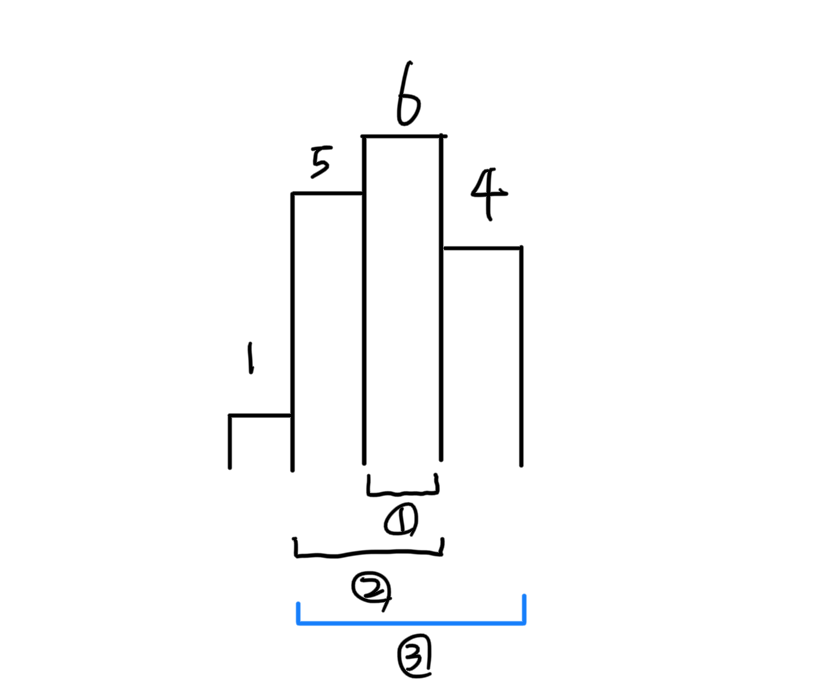

# 2104 - 부분배열 고르기

<https://www.acmicpc.net/problem/2104> p5

[1725](../1725)와 유사한 모노토닉 스택 문제입니다.

스택에 저장되는 것은 **(새로 들어온 숫자, 그 숫자가 최솟값인 부분 구간의 시작점)** 쌍입니다.

하나씩 생각을 확장해봅시다.

스택을 숫자 기준으로 오름차순 정렬 유지합니다. -(1)

새 데이터가 (1)을 만족하면 그냥 push합니다.

만족하지 않으면 (1)을 만족할 때까지 pop한 다음 push합니다.

스택에 숫자를 넣을 때, 그 숫자의 인덱스를 함께 저장해두어야 합니다.
정확히 뭘 저장하는지는 후술하겠습니다.

pop하는 상황이라면 (아래 그림에서 4가 새로 들어온 상황)

1. pop된 숫자부터 새로운 숫자 직전까지 구간의 score를 계산합니다. 숫자들의 인덱스를 같이 저장했으니 prefix sum같은 것으로 상수 시간에 구할 수 있습니다.
    1. 구간 (1)의 score를 계산합니다. pop된 (6, indexOf(6))를 이용해 계산할 수 있습니다.
    2. 구간 (2)의 score를 계산합니다. pop된 (5, indexOf(5))를 이용해 계산할 수 있습니다.
2. 더 이상 pop이 안 될 때까지 반복합니다. 1을 반복합니다.
3. pop된 숫자 중 가장 왼쪽에 있는 숫자부터 새로운 숫자까지를 새로운 구간으로 뭉뚱그려서 스택에 넣습니다. 이 구간의 최솟값은 새로운 숫자입니다.
    1. 새로운 숫자 4와 구간 (3)의 시작 인덱스인 indexOf(5)를 같이 넣습니다.

즉 스택에 저장되는 것은 **(새로 들어온 숫자, 그 숫자가 최솟값인 부분 구간의 시작점)** 쌍입니다.

**pop을 한다는 것은 더 작은 값이 들어왔으니 구간이 끝났다는 의미**입니다. 즉 해당 구간에 대한 score를 계산하고 **구간을 새로운 더 작은 값 구간에 통합시켜** 더 이상 고려하지 않습니다.

다 끝났으면 0을 푸시해서 스택에 남은 값들을 제거합니다.
입력들 끝에 0 슬쩍 넣어두면 저절로 됩니다.

처음엔 구간 합 구하기 편하게 하려고 prefix sum을 썼습니다.

근데 애초에 스택에 누적합을 저장해둬도 된다는 생각이 들어서, 그걸 제거하고 재제출했습니다.
코드는 짧아졌지만 다만 가독성은 좀 떨어진 느낌인데, 그걸 대비해서 두 코드 다 첨부합니다.

참, Long (int64) 잊으시면 저처럼 고생합니다...
