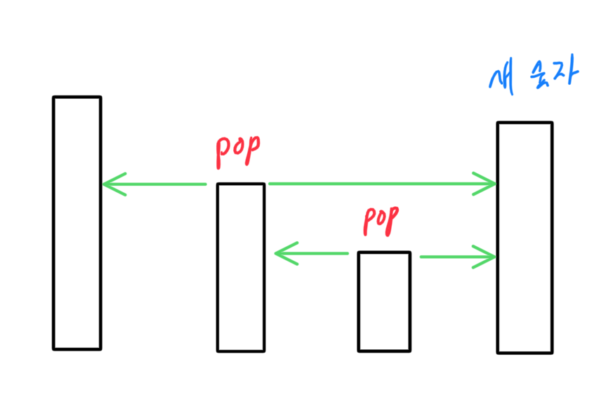
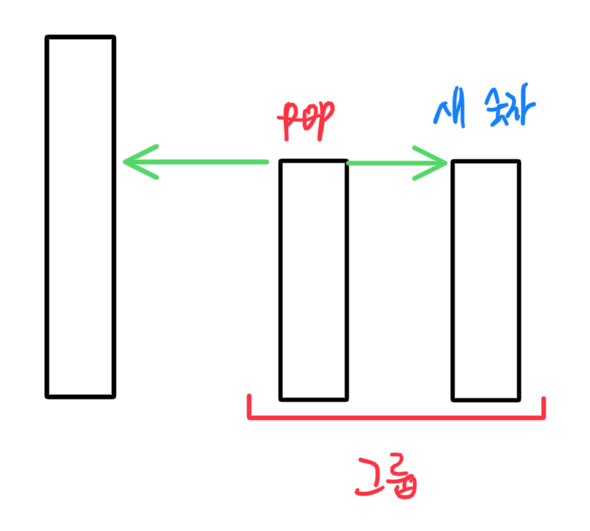
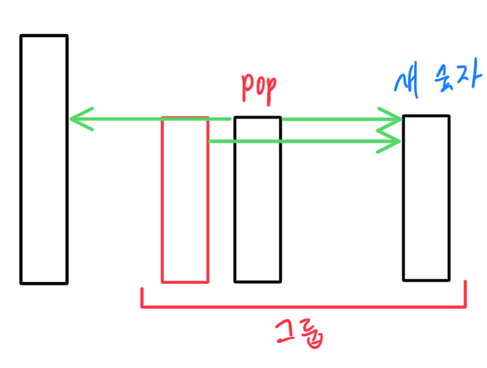
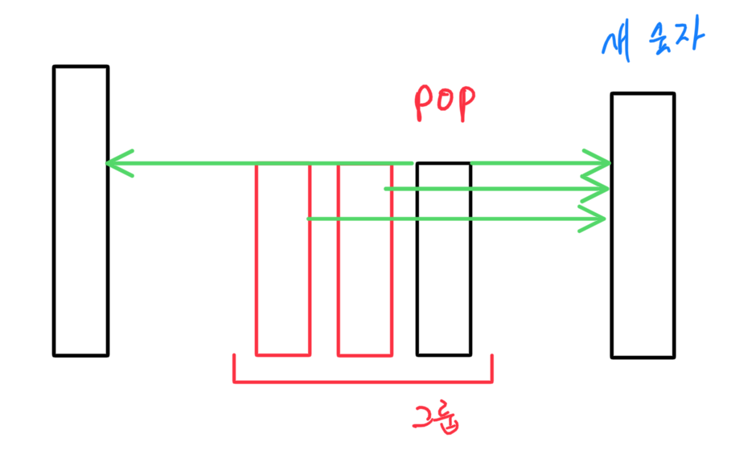

# 3015 - 오아시스 재결합

<https://www.acmicpc.net/problem/3015>

모노토닉 스택입니다.

이번엔 스택을 내림차순 정렬합니다.
스택에 저장하는 것은 (숫자, 연속된 동일 숫자 개수) 입니다.

케이스 분석이 필요합니다.

첫째: 새로 들어온 수가 더 크다면

스택이 decreasing일 때까지 pop합니다.

이때 pop한 숫자는 그 시점에서 스택의 최솟값이므로, 왼쪽 방향으로 1개, 오른쪽 방향으로 1개의 숫자만 바라보고 있을 수 있습니다.

오른쪽 방향에는 숫자가 무조건 있습니다.
새 숫자가 들어왔으니까요.

**왼쪽 방향으로는 pop한 후 스택이 비어 있어서 숫자가 없을 수도 있다는 점에 유의합시다. 그러면 왼쪽은 카운트하지 않습니다.**

따라서 pop할 때마다 결과 += if (왼쪽 있으면) 1 else 0 + 1

위 그림의 초록색 화살표들이고, 위 상황에서는 2개 pop해서 4개를 찾았습니다.

특징은, **pop한 숫자는 그 주변 숫자보다 local min입니다. 따라서 pop된 시점에서 더 이상 문제에 영향을 주지 못하고 완전히 버려집니다.**

둘째: 스택 피크와 같은 숫자가 들어오는 경우

마찬가지로 pop하고 좌 우 방향 1개씩 카운트해 답에 추가합니다.

이때, 이 문제는 서로 같은 숫자끼리는 그 너머에 있는 숫자를 볼 수 있습니다.

따라서 둘을 그룹으로 묶어두기로 합니다.
이를 스택에 (숫자, 연속된 동일 숫자 개수)를 저장하는 방식으로 구현합니다.

셋째: 그룹 숫자와 동일한 숫자가 또 들어온 경우

위에서 동일한 숫자 하나를 pop해서 그룹으로 만들고, 그 그룹의 크기만 스택에 함께 저장해두었습니다.

이 상태에서 동일한 숫자 하나가 더 들어온다면 똑같이 그룹에 편입시킵니다.

이때, 처음 그룹 형성되면서 pop된 숫자를 A, 지금 pop할 예정인 숫자를 B, 새 숫자를 C라고 합시다.

- A의 왼쪽 방향은 이미 위에서 카운트되었습니다.
- A의 오른쪽 방향에는 B와 C가 있는데, 이중 B는 카운트되었고, C는 카운트해야 합니다.
- B의 왼쪽, 오른쪽은 카운트되지 않았습니다.

상세 생략하고 일반화하면, 그룹에 새 수가 추가될 때 왼쪽 방향은 있다면 1개만, **오른쪽 방향은 그룹의 원래 크기만큼** 카운트해야 합니다.

위 이미지에서는 결과 += (0 or 1) + 2이고, 이 상태에서 동일한 숫자가 또 들어오면 결과 += (0 or 1) + 3, 또 들어온다면 결과 += (0 or 1) + 4, ... 이런 방식입니다.

넷째: 그룹의 값보다 큰 새 숫자가 추가된 경우

마찬가지로 왼쪽으로는 있다면 1개, 오른쪽으로는 그룹 개수만큼 카운트하고 pop합니다.

다섯째: 입력 순회가 다 끝나서 스택에 내림차순 값만 남은 경우

스택에 있는 모든 값들을 왼쪽방향으로만 카운팅하면 됩니다.
오른쪽 방향은 기존까지 pop한 모든 숫자가 고려해주었고, 왼쪽으로는 자기보다 큰 것 1개만 남은 것입니다.
특히 맨 마지막 원소 왼쪽에는 아무것도 없는 스택의 끝임에 유의합시다.

이를 일반화하면, 심플하게 stack.size - 1 을 결과에 추가해주면 됩니다.

결과는 50만 제곱까지 커질 수 있으므로 Long을 쓰는 것이 좋습니다.
